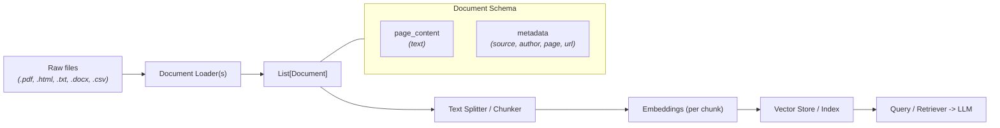
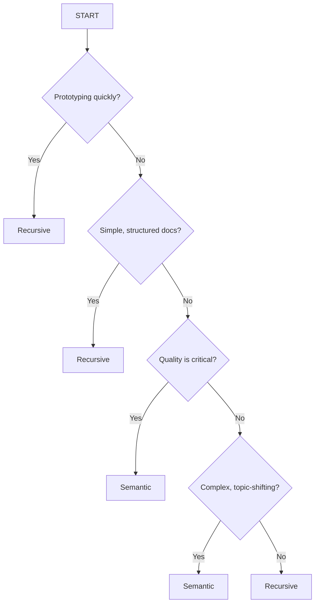
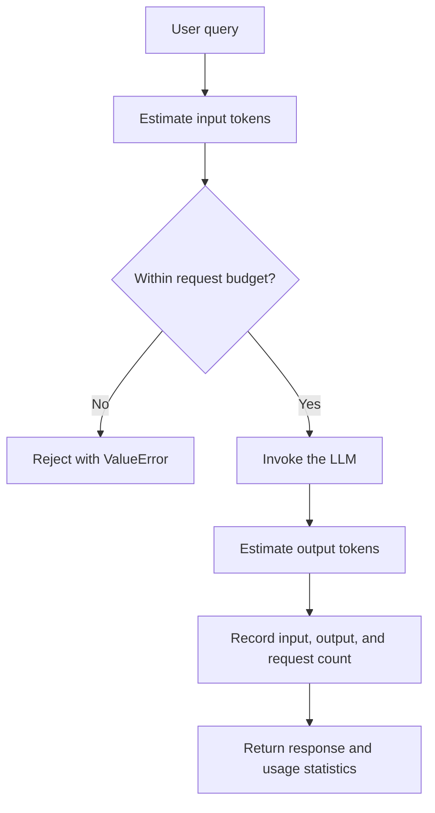
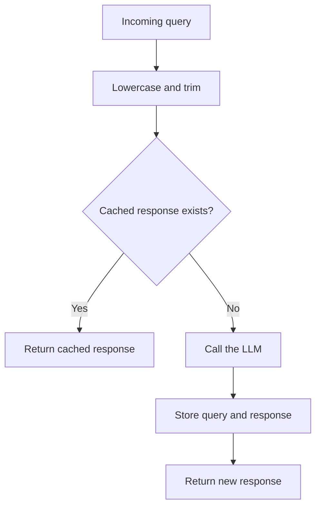
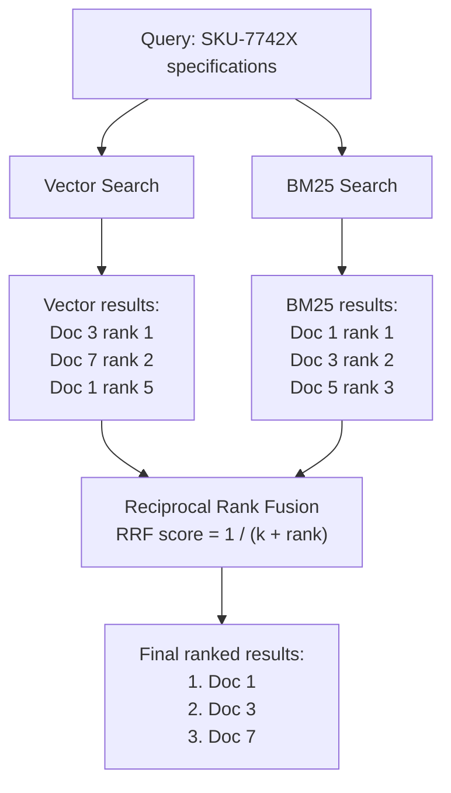

# Document Loaders & Chunking (Notes)

This document summarizes common document loaders, ingestion pipelines, and best practices for chunking (including semantic chunking).

---

## 🔄 Data Flow



---

## 📄 Document Schema

Each loaded `Document` typically contains:

- **`page_content`** — the extracted text.
- **`metadata`** — dictionary with contextual fields like `source`, `author`, `page`, `url`, `file_path`.

Include extra metadata where useful (document title, section headings, published date) to improve retrieval relevance.

---

## 🛠️ Core Document Loaders

| Loader | Source type | Notes / Best use |
| :--- | :--- | :--- |
| `PyPDFLoader` | PDF (`.pdf`) | Fast, page-by-page extraction; good for simple PDFs. |
| `PyMuPDFLoader` | PDF (`.pdf`) | Faster and often extracts richer metadata and layout information. |
| `UnstructuredPDFLoader` | PDF (`.pdf`) | Best for complex layouts (multi-column, tables); slower but more accurate. |
| `TextLoader` | Plain text (`.txt`) | Simple text extraction; minimal processing. |
| `DirectoryLoader` | Folder (`folder/*`) | Batch load files using glob patterns and optional `loader_cls`. |
| `WebBaseLoader` | Web pages (`https://`) | Scrapes and extracts page text. Use responsibly and respect robots.txt / rate limits. |
| `UnstructuredLoader` | Mixed / complex | Uses the `unstructured` package to handle many file types robustly. |

### PDF loader notes

- `PyPDFLoader`: basic extraction, fast and lightweight.
- `PyMuPDFLoader` (MuPDF / Fitz): faster, better layout metadata.
- `UnstructuredPDFLoader`: best for complex documents (tables, columns), but slower.

### Web loading

- Single URL -> `WebBaseLoader` -> single `Document` (or multiple documents if the page has clear sections).
- Multiple URLs -> `WebBaseLoader` (iterate) -> list of `Document` objects, one per URL or per page section.

### Directory loading example

Use `DirectoryLoader(path, glob="**/*.pdf", loader_cls=PyPDFLoader)` to batch-load matching files from a folder and return a list of `Document` objects.

---

## 🔁 Document Processing Pipeline (RAG-ready)

Typical pipeline for retrieval-augmented generation (RAG):

1. Document Loaders -> 2. Text Splitters / Chunkers -> 3. Embedding Generation -> 4. Vector Store / Index -> 5. Retriever -> 6. LLM

Keep metadata through the pipeline so retrieved chunks can be traced back to the original source.

---

## 📦 Chunking: Why it matters

Chunking splits text into smaller units (chunks) that are embedded and stored in a vector index. Good chunking preserves meaning within a chunk and enables accurate retrieval. Poor chunking leads to irrelevant or incomplete answers.

Key variables when chunking:

- **Chunk size** — target token length per chunk. Sweet spot: ~200–1000 tokens depending on the content type.
- **Overlap** — typically 10–20% overlap helps preserve context across chunk boundaries.
- **Split boundaries** — where you cut text: fixed, recursive (heuristic), or semantic (meaning-based).
- **Content type** — legal text, code, markdown, and conversational logs each need different split heuristics.

---

## Chunking Strategies

- **Fixed-size**: Cut into fixed token/character lengths (fast, simple; can break sentences).
- **Recursive (heuristic)**: Try paragraph -> sentence -> punctuation -> word. Good balance for many use-cases.
- **Semantic (meaning-based)**: Use embeddings + similarity between adjacent units to find meaning boundaries. Useful when topic boundaries matter more than processing cost.
- **Late chunking**: Embed a larger document first, then pool token embeddings for chunks so each chunk can retain broader document context.

Recommended default: start with recursive chunking, then evaluate semantic chunking for high-accuracy knowledge bases. Semantic chunking is not automatically better for every document; it adds embedding cost and depends on the embedding model and threshold.

---

## ⭐ Semantic Chunking (Best quality)

Semantic chunking finds splits at meaning boundaries rather than arbitrary positions. Steps:

1. Split the text into small candidate units (sentences or short paragraphs).
2. Compute embeddings for each candidate unit.
3. Compare adjacent embeddings (cosine similarity).
4. When similarity drops significantly, mark a chunk boundary.
5. Merge adjacent candidates until the target chunk size (and overlap) is reached.

Benefits:

- Produces topic-consistent chunks (fewer mixed-topic chunks).
- Improves retrieval precision for complex documents (legal, technical manuals).

Simple pseudocode:

```python
# 1) tokenize into sentences
# 2) embed each sentence
# 3) for i in range(len(sentences)-1):
#     sim = cos_sim(embed[i], embed[i+1])
#     if sim < threshold: boundary at i
```

Practical tips:

- Use a windowed approach (compare nearby neighbors, not only immediate neighbor) to avoid noisy splits.
- Choose a dynamic threshold (e.g., percentile of local similarities) rather than a fixed value for heterogeneous documents.
- After boundaries are found, merge to meet the target chunk size and desired overlap.

---

## Best Practices & Defaults

- Chunk size: 200–800 tokens for most knowledge bases.
- Overlap: 10–20%.
- Use recursive chunking as a fast default; evaluate semantic chunking for high-quality indexes.
- Preserve metadata (file, page, headings) for each chunk.
- Respect rate limits and robots.txt when scraping web pages.

---

## 🧭 Chunking Decision Framework

Use this decision flow to decide which chunking strategy to use:



| Content type | Recommended strategy | Chunk boundary / size |
| :--- | :--- | :--- |
| General documents | Recursive | Approximately 500–1000 tokens |
| Technical documents | Semantic | Semantic boundaries with a maximum size |
| Code | Code-aware splitter | Functions, classes, or logical blocks |
| Markdown | Markdown-aware splitter | Headers and sections |

### Practical recommendation

- **Recursive** is the default for speed and simplicity.
- **Semantic** is best when quality and meaning preservation matter most.
- **Code** and **Markdown** often need specialized splitting logic.

### The 80/20 rule

- **Recursive = 80% of the way**
- **Semantic = the last 20%**
- **Start recursive, upgrade if needed**

---

## 🧠 Late Chunking

Traditional chunking can lose context because each chunk is embedded in isolation. Late chunking embeds a larger document first, then creates chunk embeddings by pooling the token embeddings belonging to each chunk.

```text
Document -> full-document token embeddings -> chunk boundaries -> pooled chunk embeddings
```

This can preserve broader document context, but it requires an embedding model that supports long-context late chunking. It is not the same as splitting a document after generating one vector for the entire document.

---

## 🧮 Embeddings vs. Chat Models

- **Embedding model**: text in -> vector out. Used for similarity search.
- **Chat model**: text in -> text out. Used to generate or transform natural-language responses.

---

## 🎟️ Token Budgeting

Token budgeting controls how much text an LLM request can process and helps keep usage predictable in production.

### Why token budgeting is needed

LLM providers commonly charge based on input and output tokens. Without a budget, a long user prompt, retrieved context, or generated response can:

- Increase the cost of a single request unexpectedly.
- Exceed the model's context window and cause a request to fail.
- Increase latency because the model must process more input and output.
- Make application costs difficult to forecast and control.
- Allow one unusually large request to consume a disproportionate share of a usage quota.

Token budgeting is therefore both a cost-control mechanism and a reliability safeguard. It should be applied before calling the model, not after an oversized request has already been sent.

### What the token budget implementation does

The example uses two cooperating classes:

| Component | Responsibility |
| :--- | :--- |
| `TokenBudget` | Estimates tokens, checks request limits, records usage, and reports statistics. |
| `BudgetedLLM` | Checks a query against the budget, invokes the LLM when allowed, estimates output usage, and records the request. |

The flow is:



### How token budgeting works

1. **Estimate the input.** `estimate_tokens()` uses a lightweight approximation: word count multiplied by `1.3`. This is useful for a demo, but a production system should use the tokenizer for the selected model, such as `tiktoken` where supported.
2. **Check the limit before invocation.** `check_budget()` compares the estimated input tokens with `max_tokens_per_request`, which defaults to `4000` in `TokenBudget`.
3. **Reject oversized requests.** If the estimate is greater than the limit, `BudgetedLLM.invoke()` raises a `ValueError` and does not call the LLM.
4. **Invoke allowed requests.** Queries within the limit are sent to the configured model, such as `gpt-4o-mini` in the example.
5. **Estimate output usage.** The returned response is estimated with the same method. A production implementation should prefer token counts reported by the provider response when available.
6. **Record usage.** `record_usage()` tracks total input tokens, total output tokens, and request count.
7. **Report metrics.** `get_stats()` returns total tokens and average tokens per request, making usage visible for monitoring and cost analysis.

The example demonstrates both paths: a short question is accepted, while an intentionally long query is rejected when the budget is set to `100` tokens.

### Practical production guidance

- Set separate limits for input context and generated output when the provider supports them.
- Count system prompts, chat history, retrieved documents, and tool results, not only the user's latest message.
- Reserve headroom for the model's response so the combined request stays within the context window.
- Use the model's actual tokenizer or provider-reported usage for billing decisions; word-based estimates are only approximate.
- Record rejected requests as well as successful usage so budget failures can be diagnosed.
- Decide whether oversized requests should be rejected, summarized, or truncated. Preserve important instructions and retrieved evidence when reducing context.
- Combine per-request limits with per-user, per-tenant, and monthly spending limits for stronger cost controls.

### SemanticCache and CachedLLM

Caching avoids paying for and waiting on a new LLM response when the application has already answered the same question. The example separates cache storage from LLM orchestration:

| Component | Responsibility |
| :--- | :--- |
| `SemanticCache` | Stores queries and responses, normalizes query text, looks up cached responses, and reports the number of cached queries. |
| `CachedLLM` | Wraps the LLM, checks the cache before every invocation, calls the model only on a miss, stores new responses, and tracks hits and misses. |

The request flow is:



`SemanticCache._hash_query()` lowercases and trims the query, then creates an MD5 hash as the dictionary key. This means `What is Python?` and `What is python?` are treated as the same query. `get()` returns the stored response on a hit; otherwise it returns `None`. `set()` stores a new response, and `stats()` reports the number of cached entries.

`CachedLLM.invoke()` first calls `self.cache.get(query)`. On a hit, it increments `cache_hits` and returns the response without calling `ChatOpenAI`. On a miss, it increments `cache_misses`, invokes `gpt-4o-mini`, stores the result, and returns it. `get_stats()` calculates the cache hit rate:

$$
	ext{hit rate} = \frac{\text{cache hits}}{\text{cache hits} + \text{cache misses}}
$$

Despite its name, the current `SemanticCache` is an **exact normalized cache**, not a true semantic cache. It has an `embedder` attribute and a similarity threshold, but `get()` does not use either one. A true semantic cache would embed the incoming query, compare it with stored query vectors, and return a response when similarity exceeds a threshold such as `0.9` or `0.95`.

### Caching considerations

- Cache only responses that are safe to reuse. Avoid caching answers that depend on the current user, permissions, real-time data, or rapidly changing state unless those factors are part of the cache key.
- Include relevant context, model settings, prompt version, tenant, and user permissions in a production cache key when they can change the answer.
- Add expiration or invalidation so stale answers are not returned forever.
- Use a shared store such as Redis for multiple application instances; the example's in-memory dictionary is local to one process and is lost on restart.
- Protect sensitive prompts and responses. Do not expose one user's cached response to another user.
- Measure hit rate, latency, storage size, and the cost saved. A high hit rate is useful only when cached answers remain correct.

---

## 🔁 Phases of RAG

### Phase 1: Indexing

```text
Load -> Chunk -> Embed -> Store
```

### Phase 2: Query

```text
Embed query -> Search -> Retrieve -> Generate -> Answer
```

The query and indexed documents should use compatible embedding models. If the embedding model changes, re-embed the document collection.

---

## ✅ Three Rules of Production RAG

1. **Use the same compatible embedding model consistently** for documents and queries.
2. **Embedding quality matters more than quantity.** More vectors cannot compensate for poor representations or noisy chunks.
3. **Test retrieval independently of generation.** First verify that the correct source chunks are retrieved; then evaluate the generated answer.

---

## ⚠️ Five Common RAG Failure Modes

1. **Bad chunking** — relevant information is split apart or mixed with unrelated content.
2. **Embedding mismatch** — documents and queries use incompatible models or preprocessing.
3. **Retrieval noise** — top results are broadly similar but do not answer the question.
4. **Context overflow** — too much retrieved text exceeds the useful context or dilutes the answer.
5. **Hallucination** — the model produces unsupported claims when retrieval is incomplete or ambiguous.

---

## 🧩 Recursive Character Splitting

`RecursiveCharacterTextSplitter` does not understand meaning directly. It preserves coherence heuristically by trying configured separators in order, for example:

```text
paragraphs (\n\n) -> lines (\n) -> sentences -> words -> characters
```

Its results depend on the separator order, chunk size, overlap, and content type.

---

## 📏 Vector Normalization

Vector normalization scales a vector so its magnitude becomes 1 while preserving its direction. This can prevent magnitude from affecting similarity scores when magnitude is not intended to represent relevance:

$$
\hat{v} = \frac{v}{\lVert v \rVert}
$$

Normalization is not universally required. The embedding model, similarity metric, and vector database configuration must agree. Systems such as FAISS, Pinecone, and Chroma can use normalized or unnormalized vectors depending on their distance metric and index configuration.

---

## 🔀 Hybrid Search

Hybrid search combines:

- **Dense vector search** for semantic similarity.
- **Sparse or lexical search** such as BM25 for keywords and exact terms.

It can reduce retrieval noise because semantic search alone may miss identifiers or overvalue broad concepts. A typical system retrieves candidates from both methods and combines or reranks their scores.

### When vector search fails

Vector search can fail when a query contains terms that must match exactly or have little semantic meaning:

| Query type | Why dense search can fail | What lexical search contributes |
| :--- | :--- | :--- |
| Product codes, e.g. `SKU-7742X` | The code has little semantic meaning for the embedding model. | Exact identifier matching. |
| Error codes, e.g. `E_CONN_REFUSED` | Small character differences can change the meaning. | Finds the exact error string in troubleshooting documents. |
| Acronyms, e.g. `WCAG` | The model may not know the abbreviation or may expand it inconsistently. | Matches the acronym exactly. |
| Exact names, e.g. `John Smith Accounting` | Broad semantic matches can override the required specific name. | Preserves the exact entity or phrase match. |

These are common enterprise RAG cases, not unusual edge cases. Hybrid search is especially useful when identifiers, error messages, acronyms, names, SKUs, or other exact terms are important.

### Important clarification

Hybrid search is not a truncation strategy. It is a retrieval strategy that combines lexical and semantic signals. Truncation or reranking may be applied afterward to select the final context passed to the LLM.

### BM25 vs. vector search

| Search method | Particularly good at |
| :--- | :--- |
| **BM25 / lexical search** | Exact matches, rare terms, product codes, error codes, and IDs. |
| **Vector search** | Semantic similarity, synonyms, paraphrases, and natural-language questions. |

Each method compensates for the weaknesses of the other. Hybrid search combines both signals to improve recall and precision.

### Hybrid Search Pipeline with RRF

Reciprocal Rank Fusion (RRF) combines the rankings from vector search and BM25 without requiring their raw scores to be on the same scale.



Documents that rank well in both searches receive stronger combined rankings. In the example, `Doc 1` wins because it is the top BM25 result and also appears in the vector results.

### Why raw hybrid scores cannot be added

Hybrid search commonly uses two retrievers with incompatible score scales:

1. **Vector search** ranks documents by semantic similarity. Depending on the distance metric and implementation, scores may look like `0.85` or `0.72`.
2. **BM25** ranks documents by keyword frequency and rarity. Its scores may look like `14.5` or `9.2`.

A BM25 score of `14.5` does not represent the same level of relevance as a vector score of `0.85`. Adding the raw scores would therefore give one retriever an arbitrary advantage. Reciprocal Rank Fusion avoids this problem by ignoring raw scores and combining only document positions in each ranked list.

### Reciprocal Rank Fusion mechanics

For a document returned by a retriever, the weighted RRF contribution is:

$$
	ext{RRF contribution} = \text{weight} \times \frac{1}{\text{rank} + k}
$$

Where:

- **`weight`** controls how much the retriever contributes.
- **`rank`** is the zero-based position produced by Python's `enumerate`: first place is `0`, second place is `1`, and so on.
- **`k`** is a smoothing constant. A value such as `60` makes the difference between adjacent ranks gradual, so first place does not completely dominate.

The merge process is:

1. Run each retriever and collect its ranked results.
2. For every document, calculate its weighted RRF contribution.
3. Use a stable document key, such as an ID or normalized content, to identify the same document across retrievers.
4. Add contributions when a document appears in both result lists.
5. Sort documents by their combined RRF score and keep the desired number of results.

This rewards documents that rank well in both systems. A document with a moderate rank in vector search and BM25 can beat a document that ranks first in only one retriever.

### Production considerations

| Consideration | Recommendation |
| :--- | :--- |
| **BM25 index updates** | BM25 does not support incremental updates in the usual in-memory implementation. Rebuild it whenever documents are added or removed. |
| **Starting weights** | Begin with `weights=[0.5, 0.5]` for BM25 and vector search, then tune using representative queries. |
| **Code and ID-heavy queries** | Try `weights=[0.7, 0.3]` to give BM25 more influence for product codes, error codes, and IDs. |
| **Semantic or natural-language queries** | Try `weights=[0.3, 0.7]` to give vector search more influence. |
| **Mixed query traffic** | Keep the balanced `0.5/0.5` starting point until evaluation data shows a better split. |
| **RRF constant** | Retrieve enough candidates for fusion; `k=4` or higher is a practical minimum, while larger values such as `60` provide stronger smoothing. |
| **Latency** | Hybrid search performs two searches and may add roughly `20-50 ms`. Measure this in production and decide whether the accuracy gain justifies the cost. |

Monitor which retriever contributes the final results, as well as recall, precision, latency, and answer quality. Tune weights from query patterns and evaluation results rather than from a single example.

### When to use hybrid search

Use hybrid search when:

- Enterprise data contains product codes, error codes, IDs, acronyms, or exact names.
- Technical documentation, legal documents, or other exact terminology must be retrieved reliably.
- Queries are mixed: some require exact matching while others are semantic or conversational.
- Retrieval accuracy is more important than the small latency increase from running two searches.
- The application serves real users and retrieval quality has been evaluated on representative questions.

Pure vector search is often sufficient when:

- The application is a simple question-and-answer chatbot with mostly natural-language queries.
- The system is a quick prototype and retrieval quality is not yet a production concern.
- The workload is creative writing or another task where exact document matching is not important.
- Latency is critical and an additional `20-50 ms` is not acceptable.

| Situation | Default choice |
| :--- | :--- |
| Enterprise knowledge base with codes or IDs | **Use hybrid search** |
| Technical or legal documentation | **Use hybrid search** |
| Mixed query types | **Use hybrid search** |
| Simple semantic Q&A | **Pure vector search may be sufficient** |
| Creative writing assistant | **Pure vector search may be sufficient** |
| Latency-critical prototype | **Start with pure vector search** |

Hybrid search rarely harms retrieval quality when configured and evaluated properly, but it is not automatically the right choice for every latency-sensitive workload.

---

## Final Takeaway

There is no universal best chunk size, embedding model, or retrieval method. Start with recursive chunking, preserve metadata, use hybrid search when exact terms matter, and evaluate retrieval on representative questions before tuning generation.


Observability ->
What is observability - Understanding what our system is doing - the entire journey not just the final answer

Traces(what happened) -
- Agent flow
- Inputs/ outputs
- Tool calls
- Decisions made

Metrics(How much it cost) -
- Token count
- Latency per node
- Cost per run
- Error rates

Evals(Was it good ?)
- Correctness
- Relevance
- Human Feedback Regression detection


Using Langsmith as an observability tool


For structured docs recursive chunking is better where as for unstructured docs that's where semantic chunking shines