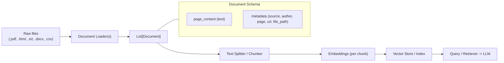
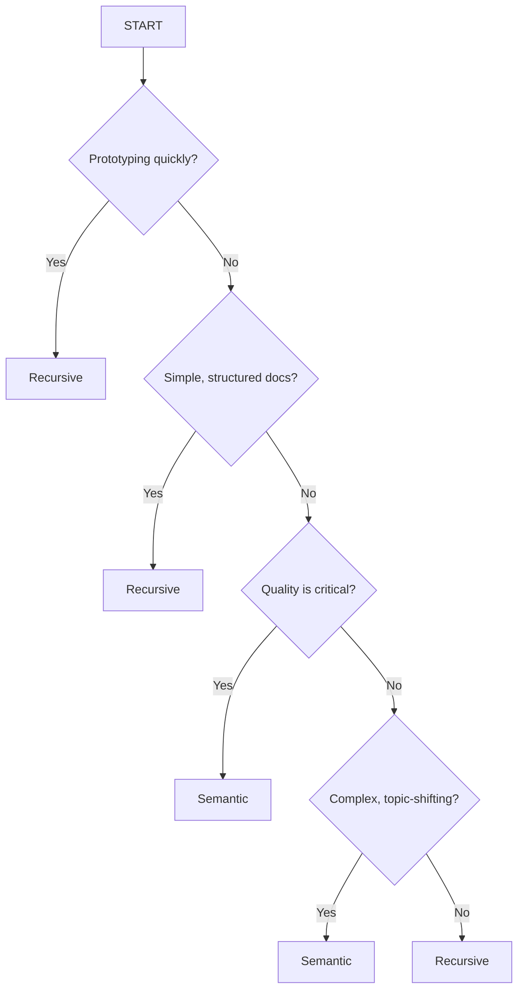
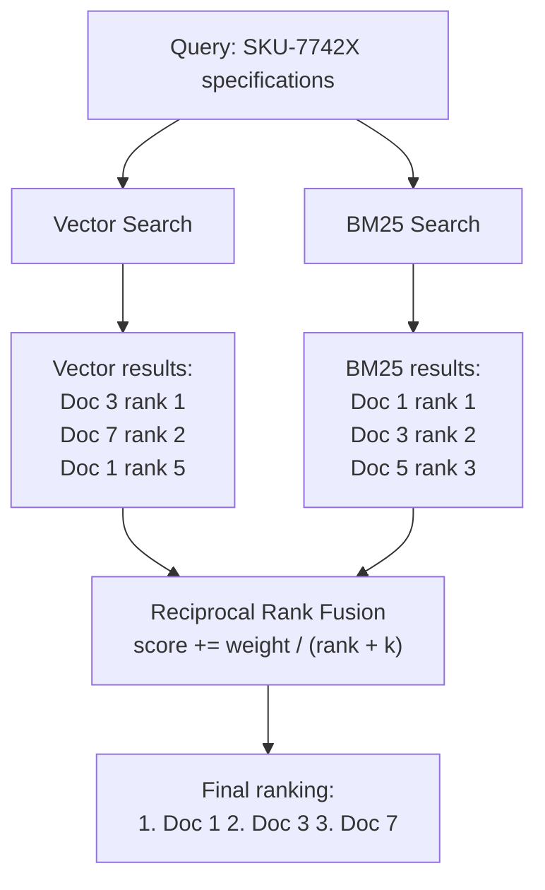
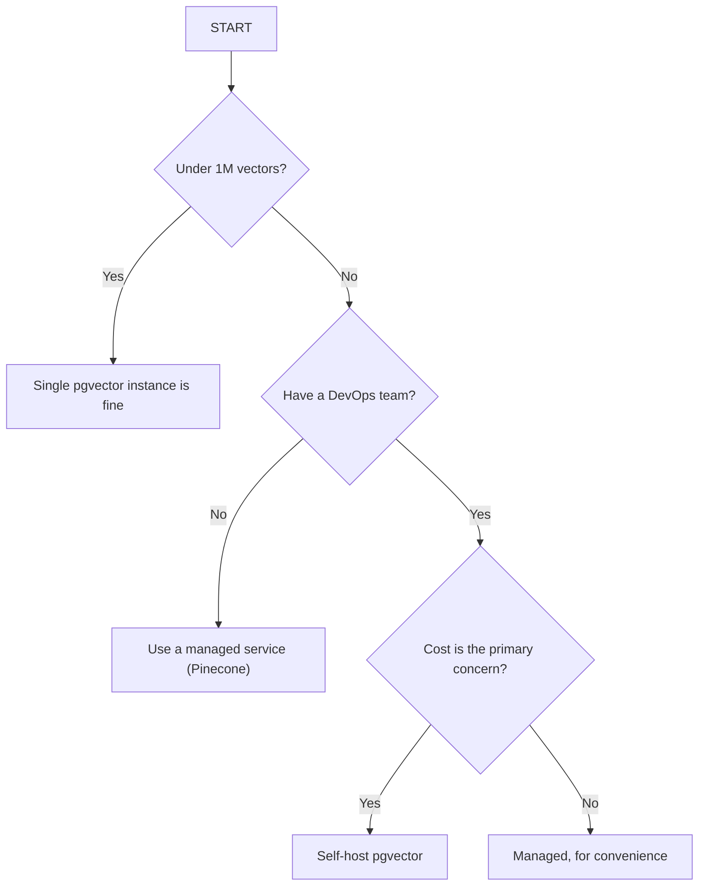
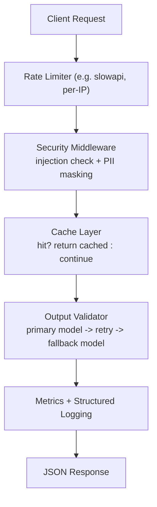

# RAG Course Knowledge Base

A revision guide for Retrieval-Augmented Generation, organized around the course's four-part structure and cross-referenced to the actual code in this repo.

| Part | Topic | What You'll Build |
| :--- | :--- | :--- |
| **Part 1** | Build the Foundation | Complete RAG pipeline from scratch |
| **Part 2** | Debug RAG Failures | Fix the 5 failure modes that break most RAG systems |
| **Part 3** | Optimize for Quality | Semantic chunking, reranking, multi-query retrieval |
| **Part 4** | Scale for Production | Caching, monitoring, production vector databases |

> **Stack used throughout this repo:** LangChain (`langchain-classic`, `langchain-community`), Google Gemini via `langchain-google-genai` (`gemini-flash-latest` for chat, `gemini-embedding-2-preview` for embeddings), Chroma as the default vector store, `rank-bm25` for lexical search, LangSmith for tracing, and `langchain-postgres` / Supabase for pgvector. `rag_pipelin/cost_optimization.py` is the one file that uses OpenAI models (`gpt-4o-mini`, `gpt-4o`) instead of Gemini — worth knowing if you go looking for it.

---

## Part 1: Build the Foundation — a Complete RAG Pipeline

### 1.1 The RAG data flow



1. Load source documents.
2. Split into chunks.
3. Embed each chunk.
4. Store vectors in a vector DB.
5. Retrieve relevant chunks for a query.
6. Pass the retrieved evidence to an LLM to generate an answer.

Keep metadata throughout the pipeline so chunks can always be traced back to the original document and source.

### 1.2 Document schema

Every LangChain `Document` has two parts:

- `page_content` — the extracted text.
- `metadata` — contextual data such as `source`, `author`, `page`, `url`, `file_path`, title, section headers.

Best practice: preserve metadata from the original source and include `source`/page/section info so retrieval results are traceable and filterable.

### 1.3 Document loaders

| Loader | Source type | Notes / best use |
| :--- | :--- | :--- |
| `PyPDFLoader` | PDF | Fast, page-by-page extraction; good for simple PDFs. |
| `PyMuPDFLoader` | PDF | Faster, often richer metadata and layout info. |
| `UnstructuredPDFLoader` / `UnstructuredLoader` | PDF, mixed formats | Best for complex layouts (multi-column, tables); slower but more accurate. |
| `TextLoader` | `.txt` | Simple text extraction. |
| `DirectoryLoader` | Folder (`glob`) | Batch load matching files, optionally with a specific `loader_cls`. |
| `WebBaseLoader` | `https://` | Scrapes and extracts page text. Respect robots.txt / rate limits. |

**What this repo actually does — [`basics/document_loaders.py`](../basics/document_loaders.py):** instead of importing `TextLoader`, `WebBaseLoader`, `DirectoryLoader`, and `PyPDFLoader`, that file hand-rolls native-Python equivalents (`Path.read_text`, `requests` + `BeautifulSoup`, `Path.rglob`, and a manual `Document(page_content=..., metadata={"source": ...})` wrap) and only reaches for a real LangChain loader — `UnstructuredLoader` — for the PDF case. It's a useful exercise for understanding what a loader does under the hood, but don't mistake it for "this is how you normally load a `.txt` file in LangChain" — normally you'd just use `TextLoader`.

### 1.4 Chunking basics

Chunking splits documents into smaller units before embedding. Key variables:

- **Chunk size** — target length per chunk (~200–1000 tokens depending on content).
- **Overlap** — typically 10–20%, to preserve context across chunk boundaries.
- **Split boundaries** — fixed, recursive (heuristic), or semantic (meaning-based).
- **Content type** — legal text, code, markdown, and conversational logs each want different heuristics.

`RecursiveCharacterTextSplitter` doesn't understand meaning directly — it tries separators in order until chunks fit the size budget:

```text
paragraphs (\n\n) -> lines (\n) -> sentences -> words -> characters
```

From [`basics/text_splitter.py`](../basics/text_splitter.py), here's why overlap matters, made concrete:

```python
text = "The quick brown fox jumps over the lazy dog." * 10

no_overlap = RecursiveCharacterTextSplitter(chunk_size=50, chunk_overlap=0)
overlap    = RecursiveCharacterTextSplitter(chunk_size=50, chunk_overlap=20)

chunks_with_no_overlap = no_overlap.split_text(text)
chunks_with_overlap    = overlap.split_text(text)
# Without overlap: chunk 2 can start mid-sentence with no lead-in context.
# With overlap: the last ~20 chars of chunk 1 reappear at the start of chunk 2,
# so a sentence split across the boundary is still readable in both chunks.
```

### 1.5 Embeddings

From [`basics/embeddings_deep.py`](../basics/embeddings_deep.py):

```python
embeddings = GoogleGenerativeAIEmbeddings(model="gemini-embedding-2-preview")

# Single text
vec = embeddings.embed_query("What is Machine Learning?")

# Batch
vecs = embeddings.embed_documents([
    "What is Machine Learning?",
    "What is Deep Learning?",
])

# Manual cosine similarity ranking
def cosine_similarity(vec1, vec2):
    return np.dot(vec1, vec2) / (np.linalg.norm(vec1) * np.linalg.norm(vec2))

similarities = [cosine_similarity(query_vector, doc_vec) for doc_vec in doc_vectors]
ranked = sorted(zip(docs, similarities), key=lambda x: x[1], reverse=True)
```

**Embedding caching** avoids re-embedding the same text on every run:

```python
from langchain_classic.embeddings.cache import CacheBackedEmbeddings
from langchain_classic.storage import LocalFileStore

store = LocalFileStore(root_path=tempdir)
cached_embeddings = CacheBackedEmbeddings.from_bytes_store(
    underlying_embeddings=embeddings,      # the real embedding model
    document_embedding_cache=store,
    namespace="exercise",
)
```

> ⚠️ **Bug found in this file:** `embedding_caching()` passes `underlying_embeddings=embeddings_model`, but only a module-level `embeddings` object is ever defined in that file — `embeddings_model` doesn't exist there. Calling `embedding_caching()` raises `NameError`. If you run this function, rename that argument to `embeddings`.

### 1.6 Vector stores

From [`basics/vector_store.py`](../basics/vector_store.py) — the three operations you'll use constantly:

```python
vectorstore = Chroma.from_documents(documents=docs, embedding=embeddings_model, persist_directory=tmpdir)

# 1. Plain similarity search
results = vectorstore.similarity_search("What is LangChain?", k=2)

# 2. Similarity search with a score attached
results_with_scores = vectorstore.similarity_search_with_score("Explain vector stores.", k=3)

# 3. Metadata filtering (pre-filter candidates before ranking)
filtered = vectorstore.similarity_search("What databases are available?", k=5, filter={"topic": "database"})
```

Score-to-similarity conversion (Chroma returns a *distance*, not a similarity, by default):

```python
similarity = 1 / (1 + distance)              # or
similarity = 1 - (distance / max_distance)   # normalize distance instead
```

### 1.7 Wiring it into a full RAG chain

From [`rag_pipelin/rag_pipeline.py`](../rag_pipelin/rag_pipeline.py) — this is the canonical "small RAG pipeline" shape used throughout the repo:

```python
retriever = vector_store.as_retriever(search_type="similarity", search_kwargs={"k": 2})

prompt = ChatPromptTemplate.from_template("""
Answer the question based only on the following context:

{context}

Question: {question}

Answer:
""")

def format_docs(docs):
    return "\n\n".join(doc.page_content for doc in docs)

rag_chain = (
    {"context": retriever | format_docs, "question": RunnablePassthrough()}
    | prompt
    | llm
    | StrOutputParser()
)

rag_chain.invoke("What is LangChain?")
```

This is the whole pattern: retriever feeds formatted context into a prompt, the LLM answers *only* from that context, and the parser strips it down to plain text. Everything in Parts 2–4 is about making each stage of this chain more accurate, more robust, or cheaper to run.

### 1.8 The two phases of RAG

```text
Phase 1 — Indexing:  Load -> Chunk -> Embed -> Store
Phase 2 — Query:     Embed query -> Search -> Retrieve -> Generate -> Answer
```

The query and the indexed documents must use a **compatible embedding model**. If the embedding model changes, you must re-embed the whole collection — old and new vectors are not comparable.

### 1.9 Three rules of production RAG

1. **Use the same, compatible embedding model consistently** for documents and queries.
2. **Embedding quality matters more than quantity.** More vectors can't compensate for noisy chunks or a weak embedding model.
3. **Test retrieval independently of generation.** First verify the correct source chunks come back; only then evaluate the generated answer. If retrieval is wrong, no amount of prompt engineering fixes the answer.

---

## Part 2: Debug RAG Failures

### 2.1 Five common failure modes

1. **Bad chunking** — relevant information is split apart or mixed with unrelated content.
2. **Embedding mismatch** — documents and queries embedded with incompatible models or preprocessing.
3. **Retrieval noise** — top results are broadly similar but don't actually answer the question.
4. **Context overflow** — too much retrieved text exceeds useful context or dilutes the answer ("lost in the middle").
5. **Hallucination** — the model states unsupported claims when retrieval is incomplete or ambiguous.

### 2.2 Vector normalization

Normalizing a vector scales it to magnitude 1 while preserving direction:

$$
\hat{v} = \frac{v}{\lVert v \rVert}
$$

This matters because some similarity metrics (dot product) are magnitude-sensitive, while cosine similarity already normalizes internally. Normalization is **not universally required** — the embedding model, similarity metric, and vector database configuration all have to agree. FAISS, Pinecone, and Chroma can each be configured for normalized or unnormalized vectors depending on their distance metric. A common silent bug: mixing a store configured for cosine distance with vectors that were never normalized (or vice versa), which quietly degrades ranking without throwing an error — a good thing to check first when "retrieval feels off."

### 2.3 When vector search fails: exact terms

Vector search can fail badly when a query hinges on terms with little semantic content:

| Query type | Why dense search fails | What lexical (BM25) search contributes |
| :--- | :--- | :--- |
| Product codes, e.g. `SKU-7742X` | Little semantic meaning for the embedding model. | Exact identifier matching. |
| Error codes, e.g. `E_CONN_REFUSED` | Small character differences can flip meaning. | Finds the exact string in troubleshooting docs. |
| Acronyms, e.g. `WCAG` | Model may not know it, or expands it inconsistently. | Matches the acronym exactly. |
| Exact names, e.g. `John Smith Accounting` | Broad semantic matches can override the specific entity. | Preserves the exact phrase match. |

These are common enterprise cases, not edge cases — this is exactly why [Part 3's hybrid search](#36-hybrid-search--hnn-bm25-ensemble-retrieval) exists.

### 2.4 A debugging checklist

When retrieval quality looks bad, check in this order:

1. **Retrieval alone**, before blaming generation — print the retrieved chunks for a failing query.
2. **Chunk boundaries** — is the answer split across two chunks with no overlap?
3. **Embedding compatibility** — same model/version for docs and query?
4. **Query type** — does it contain an exact code/name/acronym that needs BM25, not just vectors?
5. **Context size** — are you passing so many chunks that the model loses the relevant one in the middle?

---

## Part 3: Optimize for Quality

### 3.1 Chunking strategies

- **Fixed-size** — cut into fixed token/character lengths. Fast, simple, can break sentences.
- **Recursive (heuristic)** — try paragraph → sentence → punctuation → word. Good default for most content.
- **Semantic (meaning-based)** — embed small units, compare adjacent similarity, split where similarity drops. Better for topic-consistent chunks, at the cost of embedding calls at chunking time.
- **Late chunking** — embed the whole document first, then pool token embeddings into chunks, so each chunk retains broader document context.



| Content type | Recommended strategy | Boundary / size |
| :--- | :--- | :--- |
| General documents | Recursive | ~500–1000 tokens |
| Technical / unstructured prose | Semantic | Meaning boundary with a max size cap |
| Code | Code-aware splitter | Functions, classes, logical blocks |
| Markdown | Markdown-aware splitter | Headers and sections |

**Practical rule of thumb:** structured documents (clear headers, paragraphs) usually do fine with recursive chunking, because the separators already line up with meaning boundaries. Semantic chunking earns its extra embedding cost on *unstructured* prose — transcripts, long narrative text — where there are no reliable separators to split on in the first place.

### 3.2 Semantic chunking, for real

From [`chunking/semantic_chunking.py`](../chunking/semantic_chunking.py):

```python
semantic_chunker = SemanticChunker(
    embeddings,
    breakpoint_threshold_type="percentile",
    breakpoint_threshold_amount=90,   # split at the 90th percentile of dissimilarity
)
semantic_chunks = semantic_chunker.split_text(document)
```

Under the hood this is: split into sentences → embed each → compare adjacent (or windowed) embeddings via cosine similarity → cut where similarity drops sharply → merge small fragments up to a target size.

**Production version with fallback** — from [`chunking/prod_ready.py`](../chunking/prod_ready.py):

```python
def smart_chunker(text, use_semantic=True, fallback_chunk_size=500):
    if use_semantic:
        try:
            chunks = SemanticChunker(embeddings, breakpoint_threshold_type="percentile",
                                      breakpoint_threshold_amount=90).split_text(text)
            if any(len(c) > 2000 for c in chunks):     # guard against runaway chunks
                return _recursive_fallback(text, fallback_chunk_size)
            return chunks
        except Exception:
            return _recursive_fallback(text, fallback_chunk_size)   # embedding API down, etc.
    return _recursive_fallback(text, fallback_chunk_size)
```

The pattern worth remembering: semantic chunking is best-effort quality, recursive is the reliability fallback. Never ship semantic chunking without a fallback path — it depends on a live embedding call succeeding at ingest time.

### 3.3 Multi-query retrieval

From [`chunking/advanced_rag.py`](../chunking/advanced_rag.py) — generates several rephrasings of the user's question and retrieves against each, to recover documents that match different phrasing:

```python
retriever = MultiQueryRetriever.from_llm(
    retriever=vectorstore.as_retriever(search_kwargs={"k": 2}),
    llm=model,
)
docs = retriever.invoke("What tools can I use to build AI applications?")
```

Use when the query is ambiguous, recall is too low, or the same concept can be phrased many ways.

### 3.4 Contextual compression

Wraps a base retriever and strips each returned chunk down to only the sentences relevant to the query, using an LLM as the compressor:

```python
compressor = LLMChainExtractor.from_llm(llm)
compression_retriever = ContextualCompressionRetriever(
    base_compressor=compressor,
    base_retriever=vectorstore.as_retriever(search_kwargs={"k": 4}),
)
```

```text
[ Vector Store ] --(retrieves 4 full chunks)--> [ Compressor (LLMChainExtractor) ]
                                                          |
                                       (strips non-relevant filler text)
                                                          v
[ Final Prompt ] <--(only concise, relevant snippets)-----
```

Benefits: fewer tokens sent downstream, less "lost in the middle" noise, faster and cheaper final generation. Trade-off: an extra LLM call per retrieved chunk, so it adds latency and cost at query time in exchange for a cleaner prompt.

### 3.5 Parent-document retrieval

Search small chunks (precise), return their larger parent chunk (context-rich):

```python
parent_splitter = RecursiveCharacterTextSplitter(chunk_size=800, chunk_overlap=100)
child_splitter  = RecursiveCharacterTextSplitter(chunk_size=200, chunk_overlap=20)

retriever = ParentDocumentRetriever(
    vectorstore=vectorstore,   # indexes child chunks
    docstore=store,            # holds parent chunks (InMemoryStore, etc.)
    child_splitter=child_splitter,
    parent_splitter=parent_splitter,
)
retriever.add_documents([long_doc])
```

Use when the exact matching fact is small, but the answer needs the surrounding section for grounding.

### 3.6 Hybrid search — BM25 + vector ensemble retrieval

Combines lexical (BM25) and dense (vector) retrieval so exact-term queries and paraphrase-style queries both work well:

```python
bm25_retriever = BM25Retriever.from_documents(TECH_DOCS)
bm25_retriever.k = 3
semantic_retriever = vectorstore.as_retriever(search_kwargs={"k": 3})

ensemble_retriever = EnsembleRetriever(
    retrievers=[bm25_retriever, semantic_retriever],
    weights=[0.4, 0.6],
)
```

**Why raw scores can't just be added:** vector similarity scores (e.g. `0.85`) and BM25 keyword scores (e.g. `14.5`) live on completely different, incompatible scales. Adding them raw would give one retriever an arbitrary, meaningless advantage. **Reciprocal Rank Fusion (RRF)** sidesteps this by ignoring raw scores entirely and combining only each document's *rank position* in each list.



$$
\text{RRF contribution} = \text{weight} \times \frac{1}{\text{rank} + k}
$$

- **`weight`** — how much this retriever's opinion counts.
- **`rank`** — the document's position from that retriever, from `enumerate` (0-indexed by convention, though see the note below).
- **`k`** — a smoothing constant (commonly `60`) so first place doesn't completely dominate.

Don't confuse this `k` with retrieval depth — they're unrelated numbers that happen to share a letter:

| Symbol | What it controls | Typical value | Where it shows up |
| :--- | :--- | :--- | :--- |
| retriever `k` / `search_kwargs={"k": N}` | How many candidates *each* retriever returns before fusion | 3–4 | `bm25_retriever.k = 3`, `search_kwargs={"k": 3}` |
| RRF `k` (also called `c`) | Smoothing constant inside the fusion formula | 60 | `custom_ensemble_search(..., c=60)`, `hybrid_retrieve(..., rrf_k=60)` |

**Two slightly different RRF implementations exist in this repo — both valid, worth noticing the difference:**

- [`hybrid_search/prod_hybrid_search.py`](../hybrid_search/prod_hybrid_search.py): `rrf_scores[doc_id] += weight / (c + rank + 1)` — treats rank as 1-indexed (adds `+1` to the 0-indexed `enumerate` rank).
- [`hybrid_search/final_production.py`](../hybrid_search/final_production.py): `rrf_score = weight * (1.0 / (rank + rrf_k))` — uses the raw 0-indexed rank, no `+1`.

With `k=60` the difference between these two is negligible in practice, but if you're porting one of these functions, pick one convention and use it consistently rather than mixing them.

> ⚠️ **Bug found in `final_production.py`:** `HybridRetriever.add_documents()` calls `self.vectore.add_documents(documents)` — `self.vectore` is a typo for `self.vectorstore` and doesn't exist on the class, so calling `add_documents()` raises `AttributeError`.

**Tuning weights:**

| Situation | Starting weights (BM25, vector) |
| :--- | :--- |
| Unsure / mixed query traffic | `0.5 / 0.5` |
| Codes, IDs, error strings dominate | `0.7 / 0.3` |
| Natural-language, semantic queries dominate | `0.3 / 0.7` |

**Production notes:**

- BM25 has no incremental-update API in the typical in-memory implementation — rebuild it whenever documents are added or removed (see the `add_documents` method above, typo aside).
- Hybrid search runs two searches, adding roughly 20–50ms. Measure it; decide if the accuracy gain is worth it for latency-critical paths.
- Use hybrid search when your data has codes/IDs/acronyms/exact names, or query traffic is mixed. Pure vector search is fine for simple semantic Q&A, creative-writing assistants, or latency-critical prototypes.

### 3.7 Reranking — *(course topic, not yet implemented in this repo)*

The course roadmap image lists reranking as a Part 3 technique, but there's no reranker in the codebase yet — worth flagging so you know it's a gap, not something you missed reading. The general shape, for when you build it: retrieve a wider candidate set (e.g. top 20–50) cheaply with vector/hybrid search, then re-score that smaller set with a more expensive, more accurate model — a cross-encoder (scores query+document jointly instead of comparing independent embeddings) or a hosted reranker (e.g. Cohere Rerank) — and keep only the top few after re-scoring. It's a precision pass layered on top of a recall-oriented first retrieval, not a replacement for it.

---

## Part 4: Scale for Production

### 4.1 HNSW index parameters

HNSW (Hierarchical Navigable Small World graphs) is the dominant ANN index for vector search. Two parameters matter most:

| Parameter | Meaning | Effect of a higher value |
| :--- | :--- | :--- |
| `M` | Max connections per graph node | More memory, better recall/accuracy |
| `ef` (search) | Search effort at query time | Slower search, better accuracy |

In production you're usually trading off two of three: **accuracy**, **speed**, **memory**.

```sql
-- pgvector: build the index
CREATE INDEX ON documents
USING hnsw (embedding vector_cosine_ops)
WITH (m = 16, ef_construction = 64);

-- pgvector: tune query-time accuracy/speed
SET hnsw.ef_search = 100;  -- higher = more accurate, slower
```

```python
# Chroma HNSW settings
collection = client.create_collection(
    name="my_collection",
    metadata={"hnsw:M": 16, "hnsw:construction_ef": 100, "hnsw:search_ef": 50},
)
```

| Use case | `M` | `ef` | Priority |
| :--- | ---: | ---: | :--- |
| Prototype | 16 | 40 | Speed |
| Production | 16 | 100 | Balanced |
| High accuracy | 32 | 200 | Accuracy |

(The Chroma snippet above uses `search_ef: 50` rather than the "balanced" `100` — that's just a different tuning point, not an error; tune `ef_search` per your own latency/accuracy budget rather than copying a single number.)

### 4.2 When and how to scale

| Symptom | Likely cause | Fix |
| :--- | :--- | :--- |
| Query latency ≥ ~100ms | Index too large for memory | More RAM, or shard |
| Insert latency spikes | Write bottleneck | Scale writes separately from reads |
| Frequent out-of-memory errors | Index doesn't fit | Bigger instance, or shard |
| Accuracy dropping | `ef_search` too low | Increase `ef_search` |

### 4.3 Vertical vs. horizontal scaling

**Vertical (scale up):** more CPU/RAM on one instance. Simple, no code changes, but hits a hardware ceiling. Best under ~10M vectors and for small-to-moderate workloads.

**Horizontal (shard):** split data across nodes. Unlimited scale potential, but adds result-merging and coordination complexity. Best for >10M vectors or heavy throughput.

> **Rule of thumb:** most apps never need sharding. A single well-tuned instance often handles millions of vectors — don't over-engineer early.

### 4.4 Managed vs. self-hosted vector databases



| Factor | Managed (e.g. Pinecone) | Self-hosted (e.g. pgvector) |
| :--- | :--- | :--- |
| Scaling | Automatic | You manage it |
| Ops burden | ~Zero | Significant |
| Cost at scale | Higher $, pay for convenience | Lower $, pay in ops time |
| Control | Limited | Full |

> The original notes here had a garbled "Cost at scale: 65530$" cell — that was a corrupted character, not a real number. Read it as "managed tends to cost more at scale; you're buying out the ops burden."

**Purpose of each tool** (they all do similarity search over embeddings — the difference is environment and operational model):

| Tool | Purpose / environment | Best use case |
| :--- | :--- | :--- |
| `pgvector` | PostgreSQL extension | Embeddings alongside relational data, queried with SQL filters (`WHERE user_id=123 AND embedding <-> query_vector`). Best when Postgres is already central to your stack. |
| `FAISS` | In-memory C++/Python library | Fast local/GPU-accelerated search for research, prototyping, large in-memory datasets. |
| `Chroma` | Open-source Python vector DB | Developer-friendly, tight LangChain integration. Great for prototypes and small-to-medium RAG pipelines. |
| `Pinecone` | Managed cloud-native vector DB | Billions of vectors, hybrid search, automatic scaling, enterprise reliability. |

`pgvector` specifics: supports exact nearest-neighbor (perfect recall) and approximate search via IVFFlat/HNSW; distance metrics include L2, inner product, cosine, L1, Hamming, Jaccard; full ACID compliance, transactions, JOINs, point-in-time recovery — because it's just Postgres.

`Pinecone` specifics: serverless, object-storage backed; writes acknowledged in <100ms; dense, sparse, and full-text indexes behind one API; SOC 2 / HIPAA / GDPR / ISO 27001; 99.95% uptime SLA.

### 4.5 Connecting to Supabase / pgvector

From [`supabase/01_supbase_connection.py`](../supabase/01_supbase_connection.py) — a real connection pattern with SSL handling and a local-Postgres fallback:

```python
def normalize_database_url(url: str) -> str:
    """Supabase requires sslmode=require; add it if missing."""
    if ".supabase.co" in url and "sslmode=" not in url:
        return f"{url}?sslmode=require"
    return url

vectorstore = PGVector(
    embeddings=embeddings,
    collection_name="production_docs",
    connection=connection_url,
    use_jsonb=True,
)
```

The file tries Supabase first, then falls back to a local Postgres instance if the Supabase connection fails — a reasonable pattern for local dev against a prod-shaped store. CLI setup for a real project:

```bash
supabase login
supabase init
supabase link --project-ref <your-project-ref>
```

### 4.6 Caching

Two layers, cheapest first:

1. **Normalize + hash** — lowercase/trim the query, then hash it (e.g. MD5) as a cache key. Catches only *exact* (post-normalization) repeats.
2. **Semantic cache** — embed the query, search the cache by vector similarity, return the cached response if similarity ≥ a threshold (e.g. `0.9`–`0.95`). Catches paraphrases too.

From [`rag_pipelin/cost_optimization.py`](../rag_pipelin/cost_optimization.py):

```python
class SemanticCache:
    def _hash_query(self, query):
        return hashlib.md5(query.lower().strip().encode()).hexdigest()

    def get(self, query):
        return self.cache.get(self._hash_query(query), {}).get("response")   # exact match only

    def set(self, query, response):
        self.cache[self._hash_query(query)] = {"query": query, "response": response}
```

```python
class CachedLLM:
    def invoke(self, query):
        cached = self.cache.get(query)
        if cached:
            self.cache_hits += 1
            return cached, True
        self.cache_misses += 1
        response = self.llm.invoke(query).content
        self.cache.set(query, response)
        return response, False
```

$$
\text{hit rate} = \frac{\text{cache hits}}{\text{cache hits} + \text{cache misses}}
$$

> **Naming mismatch worth knowing:** despite the class name, `SemanticCache.get()` here only does an exact normalized-hash lookup — it has an `embedder` attribute and a `threshold`, but `get()` never uses either. It's an **exact cache**, not a semantic one. A true semantic cache would embed the incoming query and compare it against stored query vectors, returning a hit above the similarity threshold — the code's own trailing comment confirms this is the intended "production version," just not what's implemented yet.

**Caching considerations for production:**

- Cache only responses safe to reuse — avoid caching answers that depend on the current user, permissions, or fast-changing data unless those are part of the cache key.
- Include model settings, prompt version, tenant, and permissions in the cache key when they can change the answer.
- Add expiration/invalidation so stale answers don't live forever.
- Use a shared store (Redis) across instances — an in-memory dict, as here, is local to one process and lost on restart.
- Never let one user's cached response leak to another user.
- Measure hit rate, latency, storage size, and cost saved — a high hit rate only helps if the cached answers are still correct.

### 4.7 Cost optimization: model routing and token budgets

Also from `cost_optimization.py` — two patterns not covered above:

**Model routing** — classify query complexity with a cheap model, then route to a cheap or expensive model accordingly:

```python
class ModelRouter:
    def classify_complexity(self, query):
        # cheap_model classifies as "simple" or "complex"
        ...

    def invoke(self, query):
        complexity = self.classify_complexity(query)
        model = self.cheap_model if complexity == "simple" else self.expensive_model
        return model.invoke(query)
```

This trades one extra cheap LLM call (the classifier) for the chance to route most simple queries away from the expensive model.

**Token budgeting** — reject or track requests against a per-request token ceiling:

```python
class TokenBudget:
    def check_budget(self, text):
        tokens = self.estimate_tokens(text)     # rough: len(text.split()) * 1.3
        return tokens <= self.max_per_request, tokens
```

`BudgetedLLM` raises `ValueError` before calling the model if the estimated input tokens exceed the budget — a cheap guard against runaway prompts, though note the estimate is a rough word-count heuristic, not an actual tokenizer count (a real implementation would use `tiktoken` or the provider's tokenizer).

### 4.8 Observability: the three pillars

> Observability means understanding what the system is doing across the *entire* journey — not just judging the final answer.

| Pillar | Answers | Examples |
| :--- | :--- | :--- |
| **Traces** | What happened? | Agent flow, inputs/outputs, tool calls, decisions made |
| **Metrics** | How much did it cost? | Token count, latency per node, cost per run, error rates |
| **Evals** | Was it good? | Correctness, relevance, human feedback, regression detection |

**Traces — LangSmith**, from [`observability/langsmith_setup.py`](../observability/langsmith_setup.py):

```python
os.environ["LANGSMITH_TRACING"] = "true"

@traceable(name="named_runs_demo", tags=["production", "summarization"])
def demo_named_runs():
    chain = prompt | llm | StrOutputParser()
    return chain.invoke({"text": "..."})
```

Tags and metadata on `@traceable` let you filter traces in the LangSmith dashboard by run type, user, or request kind later.

**Metrics + structured logs**, from [`observability/monitoring.py`](../observability/monitoring.py) — logs as JSON for aggregation, plus a running metrics summary:

```python
class JSONFormatter(logging.Formatter):
    def format(self, record):
        return json.dumps({
            "timestamp": datetime.now(timezone.utc).isoformat(),
            "level": record.levelname,
            "message": record.getMessage(),
            **getattr(record, "extra_data", {}),
        })

class MetricsCollector:
    def get_summary(self):
        return {
            "error_rate": errors_total / requests_total,
            "avg_latency_ms": latency_sum / latency_count,
            "cache_hit_rate": cache_hits / (cache_hits + cache_misses),
        }
```

`InstrumentedLLM` wraps a chat model with both at once — one `@traceable` call that times the request, records tokens/latency/errors into `MetricsCollector`, and logs a structured JSON line — giving trace, metric, and log for every call from a single wrapper.

### 4.9 Production API blueprint *(course reference — not yet built in this repo)*

This is the request pipeline the course lays out for a production LLM API. It isn't implemented as code here yet (no `fastapi`/`slowapi`/Docker files exist in this repo currently) — treat it as the target architecture to build toward, stitched from the pieces above:



| Feature | Maps to | What it does |
| :--- | :--- | :--- |
| LangSmith tracing | [§4.8](#48-observability-the-three-pillars) | Every request traced with metadata |
| Input sanitization + PII masking | new | Blocks prompt injection, redacts emails/SSNs/cards before the LLM sees them |
| Error handling + retries | new | Exponential backoff, fallback models on primary failure |
| Response caching | [§4.6](#46-caching) | Skip duplicate LLM calls |
| Rate limiting | new | Per-IP throttling |
| Structured logging + metrics | [§4.8](#48-observability-the-three-pillars) | JSON logs, request count, latency, token usage |
| Health checks + Docker | new | `/health` endpoint, containerized deployment |

The end-to-end production checklist, as a pipeline of concerns:

```text
Security (sanitize input, mask PII, guard output)
   -> Cost Optimization (route, cache, budget)
   -> Error Handling (retry, circuit-break, fallback)
   -> Monitoring (log, measure, trace)
```

### 4.10 Best practices recap

- Keep chunk sizes moderate and consistent; preserve source metadata on every chunk.
- Recursive chunking by default; semantic chunking where topic boundaries matter more than ingest cost.
- Combine semantic + keyword (hybrid) search when domain-specific terms matter.
- Use compression or parent-document retrieval when context is noisy or too broad.
- Tune `M` and `ef` for your accuracy/speed/memory budget; don't shard before you need to.
- Cache aggressively but safely — key on everything that can change the answer.
- Instrument everything (traces + metrics + logs) before you need them, not after an incident.

---

## Final takeaway

There is no universal best chunk size, embedding model, or retrieval method. Start with recursive chunking, preserve metadata, add hybrid search when exact terms matter, and evaluate retrieval independently of generation on representative questions before tuning anything else.

---

## Appendix: verification notes on this repo

Things checked against the actual code while rewriting this doc, for future reference:

- **`basics/embeddings_deep.py`** — `embedding_caching()` references an undefined `embeddings_model` (only `embeddings` exists at module scope). Will raise `NameError` if called.
- **`hybrid_search/final_production.py`** — `HybridRetriever.add_documents()` calls `self.vectore.add_documents(...)`; should be `self.vectorstore`. Will raise `AttributeError` if called.
- **`hybrid_search/prod_hybrid_search.py` vs `final_production.py`** — implement RRF with a one-position rank offset difference (`rank + 1` vs raw `rank`). Both are defensible RRF variants; not a bug, just an inconsistency if you're copying code between them.
- **`basics/document_loaders.py`** — despite the name, mostly implements native-Python alternatives to LangChain's loader classes rather than calling `TextLoader`/`WebBaseLoader`/`DirectoryLoader` directly. Only the PDF path uses a real LangChain loader (`UnstructuredLoader`).
- The original version of this document had a corrupted "Cost at scale: 65530$" table cell (an encoding artifact, not a real figure) and several other mangled Unicode characters (stray `â`, `ð` sequences) — cleaned up throughout.
- Reranking is named in the course's Part 3 roadmap and the production-API slide, but there's no reranker implementation anywhere in this repo yet — flagged above as a gap rather than silently omitted.
- A few screenshots referenced when preparing this pass (python.org downloads/iOS/Windows-installer pages) didn't correspond to anything in the RAG curriculum or this codebase, so nothing from them was incorporated here — flagging in case they were meant for a different note.
