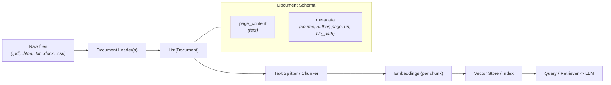
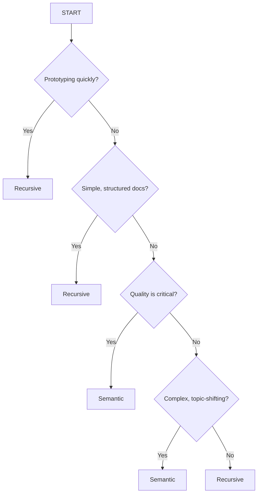
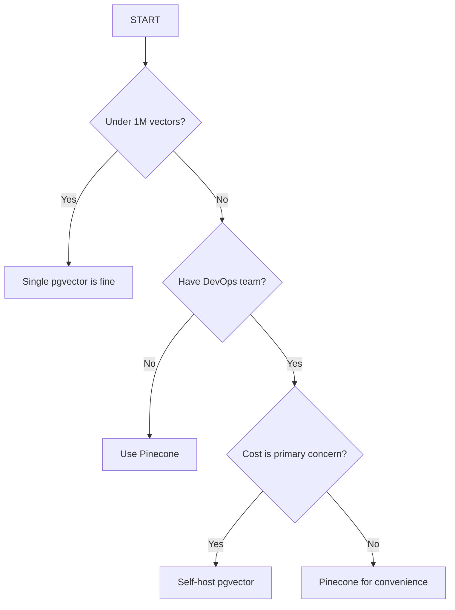
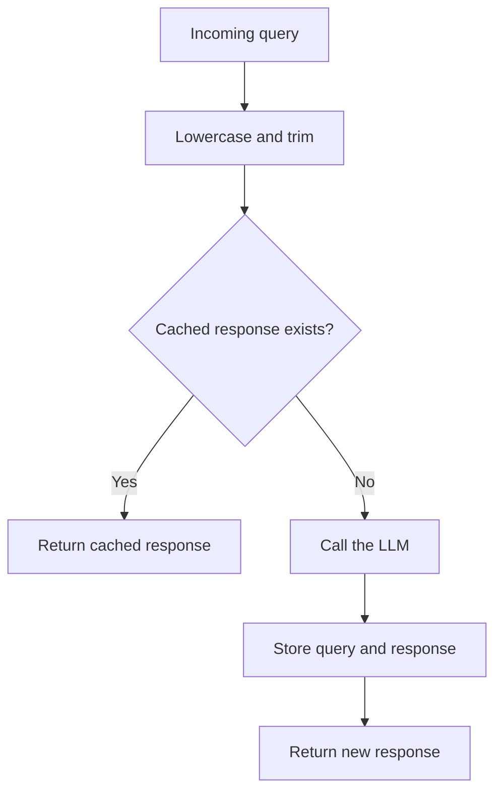
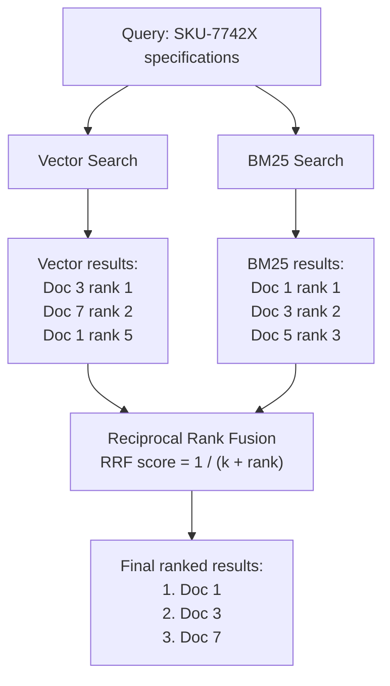

# Document Loaders, Chunking, and Advanced RAG Patterns

This document consolidates the ingestions patterns, chunking strategies, and advanced retrieval techniques used in the project. It also captures the practical scaling guidance for vector databases and production trade-offs shown in the course visuals.

---

## 1. RAG Data Flow



A typical retrieval-augmented generation pipeline is:

1. Load source documents.
2. Split into chunks.
3. Embed each chunk.
4. Store vectors in a vector DB.
5. Retrieve relevant chunks.
6. Pass the retrieved evidence to an LLM.

Keep metadata throughout the pipeline so chunks can be traced back to the original document and source.

---

## 2. Document Schema

Each loaded `Document` usually includes:

- `page_content`: the extracted text.
- `metadata`: contextual data such as `source`, `author`, `page`, `url`, `file_path`, document title, and section headers.

Best practice:

- Preserve metadata from the original source.
- Include `source` and page/section metadata for higher-precision retrieval.
- Store enough context so the retriever can explain where a result came from.

---

## 3. Core Document Loaders

| Loader | Source type | Notes / Best use |
| :--- | :--- | :--- |
| `PyPDFLoader` | PDF (`.pdf`) | Fast, page-by-page extraction; good for simple PDFs. |
| `PyMuPDFLoader` | PDF (`.pdf`) | Faster and often extracts richer metadata and layout information. |
| `UnstructuredPDFLoader` | PDF (`.pdf`) | Best for complex layouts (multi-column, tables); slower but more accurate. |
| `TextLoader` | Plain text (`.txt`) | Simple text extraction; minimal processing. |
| `DirectoryLoader` | Folder (`folder/*`) | Batch load files using glob patterns and optional `loader_cls`. |
| `WebBaseLoader` | Web pages (`https://`) | Scrapes and extracts page text. Use responsibly and respect robots.txt / rate limits. |
| `UnstructuredLoader` | Mixed / complex | Uses the `unstructured` package to handle many file types robustly. |

### Loader notes

- `PyPDFLoader`: basic extraction, fast and lightweight.
- `PyMuPDFLoader` (MuPDF / Fitz): faster, better layout metadata.
- `UnstructuredPDFLoader`: best for complex documents (tables, columns), but slower.

### Web loading

- Single URL -> `WebBaseLoader` -> single `Document` (or multiple documents if the page has clear sections).
- Multiple URLs -> `WebBaseLoader` (iterate) -> list of `Document` objects, one per URL or per page section.

### Directory loading example

Use `DirectoryLoader(path, glob="**/*.pdf", loader_cls=PyPDFLoader)` to batch-load matching files from a folder and return a list of `Document` objects.

---

## 🔁 Document Processing Pipeline (RAG-ready)

Typical pipeline for retrieval-augmented generation (RAG):

1. Document Loaders -> 2. Text Splitters / Chunkers -> 3. Embedding Generation -> 4. Vector Store / Index -> 5. Retriever -> 6. LLM

Keep metadata through the pipeline so retrieved chunks can be traced back to the original source.

---

## 4. Chunking: Why it matters

Chunking is the process of splitting documents into smaller units before embedding. Good chunking improves retrieval quality, while poor chunking can bury relevant context or mix unrelated ideas in the same chunk.

Key variables when chunking:

- **Chunk size** — target token length per chunk. Sweet spot: ~200–1000 tokens depending on the content type.
- **Overlap** — typically 10–20% overlap helps preserve context across chunk boundaries.
- **Split boundaries** — where you cut text: fixed, recursive (heuristic), or semantic (meaning-based).
- **Content type** — legal text, code, markdown, and conversational logs each need different split heuristics.

---

## Chunking Strategies

- **Fixed-size**: Cut into fixed token/character lengths (fast, simple; can break sentences).
- **Recursive (heuristic)**: Try paragraph -> sentence -> punctuation -> word. Good balance for many use-cases.
- **Semantic (meaning-based)**: Use embeddings + similarity between adjacent units to find meaning boundaries. Useful when topic boundaries matter more than processing cost.
- **Late chunking**: Embed a larger document first, then pool token embeddings for chunks so each chunk can retain broader document context.

Recommended default: start with recursive chunking, then evaluate semantic chunking for high-accuracy knowledge bases. Semantic chunking is not automatically better for every document; it adds embedding cost and depends on the embedding model and threshold.

---

## ⭐ Semantic Chunking (Best quality)

Semantic chunking finds splits at meaning boundaries rather than arbitrary positions. Steps:

1. Split the text into small candidate units (sentences or short paragraphs).
2. Compute embeddings for each candidate unit.
3. Compare adjacent embeddings (cosine similarity).
4. When similarity drops significantly, mark a chunk boundary.
5. Merge adjacent candidates until the target chunk size (and overlap) is reached.

Benefits:

- Produces topic-consistent chunks (fewer mixed-topic chunks).
- Improves retrieval precision for complex documents (legal, technical manuals).

Simple pseudocode:

```python
# 1) tokenize into sentences
# 2) embed each sentence
# 3) for i in range(len(sentences)-1):
#     sim = cos_sim(embed[i], embed[i+1])
#     if sim < threshold: boundary at i
```

Practical tips:

- Use a windowed approach (compare nearby neighbors, not only immediate neighbor) to avoid noisy splits.
- Choose a dynamic threshold (e.g., percentile of local similarities) rather than a fixed value for heterogeneous documents.
- After boundaries are found, merge to meet the target chunk size and desired overlap.

---

## Best Practices & Defaults

- Chunk size: 200–800 tokens for most knowledge bases.
- Overlap: 10–20%.
- Use recursive chunking as a fast default; evaluate semantic chunking for high-quality indexes.
- Preserve metadata (file, page, headings) for each chunk.
- Respect rate limits and robots.txt when scraping web pages.

---

## 🧭 Chunking Decision Framework

Use this decision flow to decide which chunking strategy to use:



| Content type | Recommended strategy | Chunk boundary / size |
| :--- | :--- | :--- |
| General documents | Recursive | Approximately 500–1000 tokens |
| Technical documents | Semantic | Semantic boundaries with a maximum size |
| Code | Code-aware splitter | Functions, classes, or logical blocks |
| Markdown | Markdown-aware splitter | Headers and sections |

### Practical recommendation

- **Recursive** is the default for speed and simplicity.
- **Semantic** is best when quality and meaning preservation matter most.
- **Late chunking** is useful for long-context retrieval when broad document context is valuable.

---

## 6. Advanced RAG Patterns in the Project

The project demonstrates several retrieval patterns beyond a simple vector similarity lookup.

### 6.1 Multi-query retriever

`MultiQueryRetriever` generates multiple reformulations of the same user question and retrieves against each variant. This helps recover documents that match different phrasing or synonyms.

Example pattern from the code:

```python
retriever = MultiQueryRetriever.from_llm(
    retriever=vectorstore.as_retriever(search_kwargs={"k": 2}),
    llm=model,
)

query = "What tools can I use to build AI applications?"
docs = retriever.invoke(query)
```

Use when:

- the user query is ambiguous,
- your retrieval needs better recall,
- the same concept can be described in multiple ways.

### 6.2 Contextual compression retriever

`ContextualCompressionRetriever` wraps a base retriever and compresses or filters the returned content before it reaches the model. This reduces noise and keeps the context smaller.

Example pattern:

```python
compressor = LLMChainExtractor.from_llm(llm)
compression_retriever = ContextualCompressionRetriever(
    base_compressor=compressor,
    base_retriever=vectorstore.as_retriever(search_kwargs={"k": 4}),
)
```

Use when:

- retrieved chunks are too verbose,
- a high-level semantic search returns mixed or noisy passages,
- you want to preserve only the relevant evidence.

### 6.3 Ensemble / hybrid search

Hybrid search combines lexical retrieval and vector retrieval.

Example pattern:

```python
bm25_retriever = BM25Retriever.from_documents(TECH_DOCS)
bm25_retriever.k = 3
semantic_retriever = vectorstore.as_retriever(search_kwargs={"k": 3})

ensemble_retriever = EnsembleRetriever(
    retrievers=[bm25_retriever, semantic_retriever],
    weights=[0.4, 0.6],
)
```

Why it matters:

- **BM25** is strong for exact keyword matching and technical terms.
- **Semantic retrieval** is strong for conceptual similarity and paraphrases.
- **Hybrid search** balances both.

This is useful for queries like:

- "fast similarity lookup for embeddings"
- "ACID transactions"
- "How do I store AI model outputs for later retrieval?"

### 6.4 Parent-document retriever

`ParentDocumentRetriever` stores both a small child chunk for search and a larger parent chunk for context. This is useful when the best retrieval chunk is small, but the final answer needs broader surrounding context.

Example logic from the project:

```python
parent_splitter = RecursiveCharacterTextSplitter(chunk_size=800, chunk_overlap=100)
child_splitter = RecursiveCharacterTextSplitter(chunk_size=200, chunk_overlap=20)

retriever = ParentDocumentRetriever(
    vectorstore=vectorstore,
    docstore=store,
    child_splitter=child_splitter,
    parent_splitter=parent_splitter,
)
```

Use when:

- the relevant fact is small, but the surrounding section matters,
- you want precise retrieval without losing document-level context,
- you need richer answer grounding for long docs.

---

## 7. Production Vector Search: HNSW Trade-offs

The course image highlights the most important choices in HNSW vector indexing.

### Two parameters that matter

| Parameter | Meaning | Effect of higher value |
| :--- | :--- | :--- |
| `M` | Maximum connections per node | More memory, better recall/accuracy |
| `ef` | Search effort during query-time traversal | Slower search, better accuracy |

### Practical trade-off summary

- **More `M`** = more connections = more memory = better accuracy.
- **More `ef`** = more search effort = slower = better accuracy.
- In production, you usually must pick two among: **accuracy**, **speed**, and **memory**.

### Typical production choices

| Use case | `M` | `ef` | Priority |
| :--- | ---: | ---: | :--- |
| Prototype | 16 | 40 | Speed |
| Production | 16 | 100 | Balanced |
| High accuracy | 32 | 200 | Accuracy |

This is the classic vector-search production trade-off: increasing recall and accuracy generally costs more time and memory.

---

## 8. When and How to Scale Vector Stores

### Vertical scaling (scale up)

Vertical scaling means increasing CPU and RAM on a single database instance.

Pros:

- simple deployment,
- no code changes,
- lower operational complexity.

Cons:

- hardware limits,
- capacity ceiling.

Best for:

- under roughly 10M vectors,
- moderate to small production workloads,
- teams that want the simplest setup first.

### Horizontal scaling (shard)

Horizontal scaling means splitting data across multiple nodes or instances.

Pros:

- unlimited scale potential,
- stronger capacity for very large indexes.

Cons:

- more complex architecture,
- result merging and coordination overhead,
- higher operational complexity.

Best for:

- larger production systems,
- more than 10M vectors,
- workloads with heavy throughput and memory demands.

### Rule of thumb

> Most apps never need sharding. A single well-tuned instance often handles millions of vectors. Don’t over-engineer too early.

---

## 9. Managed vs Self-hosted Vector Databases

The image recommends a practical decision flow for choosing between managed and self-hosted vector databases.

### Key comparison

| Factor | Managed (e.g. Pinecone) | Self-hosted (e.g. pgvector) |
| :--- | :--- | :--- |
| Scaling | Automatic | You manage |
| Ops burden | Zero | Significant |
| Cost at scale | 65530$ | Lower $ |
| Control | Limited | Full |

### Decision flow



### Practical guidance

- If you are small or early-stage, start with a single `pgvector` instance or a managed service.
- If you have no ops capacity, a managed vector DB is usually the easiest route.
- If your vector count grows and cost becomes critical, self-hosting can become attractive.
- If you have strong engineering operations capacity and need more control, self-hosting can be a smart long-term decision.

---

## 10. Best Practices for Production RAG

- Keep chunk sizes moderate and consistent.
- Preserve source metadata with each chunk.
- Use recursive chunking first, then improve with semantic chunking if needed.
- Combine semantic retrieval with keyword search when domain-specific terms matter.
- Use compression or parent-document patterns when retrieval context is noisy or too broad.
- Tune `M` and `ef` based on the accuracy–speed–memory trade-off.
- Avoid scaling too early; single-instance optimization solves most real-world cases.
- Use managed services when convenience and zero ops burden matter more than raw control.

---

## 11. Summary

The project demonstrates that retrieval quality depends on three things working together:

1. Good document ingestion and metadata preservation.
2. Strong chunking strategy based on content type.
3. An appropriate retrieval pattern for the question and latency requirements.

For production systems, the right answer is rarely “the biggest or most advanced architecture.” It is usually the smallest system that meets the retrieval quality and latency goals with enough headroom to scale when needed.

### SemanticCache and CachedLLM

Caching avoids paying for and waiting on a new LLM response when the application has already answered the same question. The example separates cache storage from LLM orchestration:

| Component | Responsibility |
| :--- | :--- |
| `SemanticCache` | Stores queries and responses, normalizes query text, looks up cached responses, and reports the number of cached queries. |
| `CachedLLM` | Wraps the LLM, checks the cache before every invocation, calls the model only on a miss, stores new responses, and tracks hits and misses. |

The request flow is:



`SemanticCache._hash_query()` lowercases and trims the query, then creates an MD5 hash as the dictionary key. This means `What is Python?` and `What is python?` are treated as the same query. `get()` returns the stored response on a hit; otherwise it returns `None`. `set()` stores a new response, and `stats()` reports the number of cached entries.

`CachedLLM.invoke()` first calls `self.cache.get(query)`. On a hit, it increments `cache_hits` and returns the response without calling `ChatOpenAI`. On a miss, it increments `cache_misses`, invokes `gpt-4o-mini`, stores the result, and returns it. `get_stats()` calculates the cache hit rate:

$$
	ext{hit rate} = \frac{\text{cache hits}}{\text{cache hits} + \text{cache misses}}
$$

Despite its name, the current `SemanticCache` is an **exact normalized cache**, not a true semantic cache. It has an `embedder` attribute and a similarity threshold, but `get()` does not use either one. A true semantic cache would embed the incoming query, compare it with stored query vectors, and return a response when similarity exceeds a threshold such as `0.9` or `0.95`.

### Caching considerations

- Cache only responses that are safe to reuse. Avoid caching answers that depend on the current user, permissions, real-time data, or rapidly changing state unless those factors are part of the cache key.
- Include relevant context, model settings, prompt version, tenant, and user permissions in a production cache key when they can change the answer.
- Add expiration or invalidation so stale answers are not returned forever.
- Use a shared store such as Redis for multiple application instances; the example's in-memory dictionary is local to one process and is lost on restart.
- Protect sensitive prompts and responses. Do not expose one user's cached response to another user.
- Measure hit rate, latency, storage size, and the cost saved. A high hit rate is useful only when cached answers remain correct.

---

## 🔁 Phases of RAG

### Phase 1: Indexing

```text
Load -> Chunk -> Embed -> Store
```

### Phase 2: Query

```text
Embed query -> Search -> Retrieve -> Generate -> Answer
```

The query and indexed documents should use compatible embedding models. If the embedding model changes, re-embed the document collection.

---

## ✅ Three Rules of Production RAG

1. **Use the same compatible embedding model consistently** for documents and queries.
2. **Embedding quality matters more than quantity.** More vectors cannot compensate for poor representations or noisy chunks.
3. **Test retrieval independently of generation.** First verify that the correct source chunks are retrieved; then evaluate the generated answer.

---

## ⚠️ Five Common RAG Failure Modes

1. **Bad chunking** — relevant information is split apart or mixed with unrelated content.
2. **Embedding mismatch** — documents and queries use incompatible models or preprocessing.
3. **Retrieval noise** — top results are broadly similar but do not answer the question.
4. **Context overflow** — too much retrieved text exceeds the useful context or dilutes the answer.
5. **Hallucination** — the model produces unsupported claims when retrieval is incomplete or ambiguous.

---

## 🧩 Recursive Character Splitting

`RecursiveCharacterTextSplitter` does not understand meaning directly. It preserves coherence heuristically by trying configured separators in order, for example:

```text
paragraphs (\n\n) -> lines (\n) -> sentences -> words -> characters
```

Its results depend on the separator order, chunk size, overlap, and content type.

---

## 📏 Vector Normalization

Vector normalization scales a vector so its magnitude becomes 1 while preserving its direction. This can prevent magnitude from affecting similarity scores when magnitude is not intended to represent relevance:

$$
\hat{v} = \frac{v}{\lVert v \rVert}
$$

Normalization is not universally required. The embedding model, similarity metric, and vector database configuration must agree. Systems such as FAISS, Pinecone, and Chroma can use normalized or unnormalized vectors depending on their distance metric and index configuration.

---

## 🔀 Hybrid Search

Hybrid search combines:

- **Dense vector search** for semantic similarity.
- **Sparse or lexical search** such as BM25 for keywords and exact terms.

It can reduce retrieval noise because semantic search alone may miss identifiers or overvalue broad concepts. A typical system retrieves candidates from both methods and combines or reranks their scores.

### When vector search fails

Vector search can fail when a query contains terms that must match exactly or have little semantic meaning:

| Query type | Why dense search can fail | What lexical search contributes |
| :--- | :--- | :--- |
| Product codes, e.g. `SKU-7742X` | The code has little semantic meaning for the embedding model. | Exact identifier matching. |
| Error codes, e.g. `E_CONN_REFUSED` | Small character differences can change the meaning. | Finds the exact error string in troubleshooting documents. |
| Acronyms, e.g. `WCAG` | The model may not know the abbreviation or may expand it inconsistently. | Matches the acronym exactly. |
| Exact names, e.g. `John Smith Accounting` | Broad semantic matches can override the required specific name. | Preserves the exact entity or phrase match. |

These are common enterprise RAG cases, not unusual edge cases. Hybrid search is especially useful when identifiers, error messages, acronyms, names, SKUs, or other exact terms are important.

### Important clarification

Hybrid search is not a truncation strategy. It is a retrieval strategy that combines lexical and semantic signals. Truncation or reranking may be applied afterward to select the final context passed to the LLM.

### BM25 vs. vector search

| Search method | Particularly good at |
| :--- | :--- |
| **BM25 / lexical search** | Exact matches, rare terms, product codes, error codes, and IDs. |
| **Vector search** | Semantic similarity, synonyms, paraphrases, and natural-language questions. |

Each method compensates for the weaknesses of the other. Hybrid search combines both signals to improve recall and precision.

### Hybrid Search Pipeline with RRF

Reciprocal Rank Fusion (RRF) combines the rankings from vector search and BM25 without requiring their raw scores to be on the same scale.



Documents that rank well in both searches receive stronger combined rankings. In the example, `Doc 1` wins because it is the top BM25 result and also appears in the vector results.

### Why raw hybrid scores cannot be added

Hybrid search commonly uses two retrievers with incompatible score scales:

1. **Vector search** ranks documents by semantic similarity. Depending on the distance metric and implementation, scores may look like `0.85` or `0.72`.
2. **BM25** ranks documents by keyword frequency and rarity. Its scores may look like `14.5` or `9.2`.

A BM25 score of `14.5` does not represent the same level of relevance as a vector score of `0.85`. Adding the raw scores would therefore give one retriever an arbitrary advantage. Reciprocal Rank Fusion avoids this problem by ignoring raw scores and combining only document positions in each ranked list.

### Reciprocal Rank Fusion mechanics

For a document returned by a retriever, the weighted RRF contribution is:

$$
	ext{RRF contribution} = \text{weight} \times \frac{1}{\text{rank} + k}
$$

Where:

- **`weight`** controls how much the retriever contributes.
- **`rank`** is the zero-based position produced by Python's `enumerate`: first place is `0`, second place is `1`, and so on.
- **`k`** is a smoothing constant. A value such as `60` makes the difference between adjacent ranks gradual, so first place does not completely dominate.

The merge process is:

1. Run each retriever and collect its ranked results.
2. For every document, calculate its weighted RRF contribution.
3. Use a stable document key, such as an ID or normalized content, to identify the same document across retrievers.
4. Add contributions when a document appears in both result lists.
5. Sort documents by their combined RRF score and keep the desired number of results.

This rewards documents that rank well in both systems. A document with a moderate rank in vector search and BM25 can beat a document that ranks first in only one retriever.

### Production considerations

| Consideration | Recommendation |
| :--- | :--- |
| **BM25 index updates** | BM25 does not support incremental updates in the usual in-memory implementation. Rebuild it whenever documents are added or removed. |
| **Starting weights** | Begin with `weights=[0.5, 0.5]` for BM25 and vector search, then tune using representative queries. |
| **Code and ID-heavy queries** | Try `weights=[0.7, 0.3]` to give BM25 more influence for product codes, error codes, and IDs. |
| **Semantic or natural-language queries** | Try `weights=[0.3, 0.7]` to give vector search more influence. |
| **Mixed query traffic** | Keep the balanced `0.5/0.5` starting point until evaluation data shows a better split. |
| **RRF constant** | Retrieve enough candidates for fusion; `k=4` or higher is a practical minimum, while larger values such as `60` provide stronger smoothing. |
| **Latency** | Hybrid search performs two searches and may add roughly `20-50 ms`. Measure this in production and decide whether the accuracy gain justifies the cost. |

Monitor which retriever contributes the final results, as well as recall, precision, latency, and answer quality. Tune weights from query patterns and evaluation results rather than from a single example.

### When to use hybrid search

Use hybrid search when:

- Enterprise data contains product codes, error codes, IDs, acronyms, or exact names.
- Technical documentation, legal documents, or other exact terminology must be retrieved reliably.
- Queries are mixed: some require exact matching while others are semantic or conversational.
- Retrieval accuracy is more important than the small latency increase from running two searches.
- The application serves real users and retrieval quality has been evaluated on representative questions.

Pure vector search is often sufficient when:

- The application is a simple question-and-answer chatbot with mostly natural-language queries.
- The system is a quick prototype and retrieval quality is not yet a production concern.
- The workload is creative writing or another task where exact document matching is not important.
- Latency is critical and an additional `20-50 ms` is not acceptable.

| Situation | Default choice |
| :--- | :--- |
| Enterprise knowledge base with codes or IDs | **Use hybrid search** |
| Technical or legal documentation | **Use hybrid search** |
| Mixed query types | **Use hybrid search** |
| Simple semantic Q&A | **Pure vector search may be sufficient** |
| Creative writing assistant | **Pure vector search may be sufficient** |
| Latency-critical prototype | **Start with pure vector search** |

Hybrid search rarely harms retrieval quality when configured and evaluated properly, but it is not automatically the right choice for every latency-sensitive workload.

---

## Final Takeaway

There is no universal best chunk size, embedding model, or retrieval method. Start with recursive chunking, preserve metadata, use hybrid search when exact terms matter, and evaluate retrieval on representative questions before tuning generation.


Observability ->
What is observability - Understanding what our system is doing - the entire journey not just the final answer

Traces(what happened) -
- Agent flow
- Inputs/ outputs
- Tool calls
- Decisions made

Metrics(How much it cost) -
- Token count
- Latency per node
- Cost per run
- Error rates

Evals(Was it good ?)
- Correctness
- Relevance
- Human Feedback Regression detection


Using Langsmith as an observability tool


For structured docs recursive chunking is better where as for unstructured docs that's where semantic chunking shines

Advanced RAG Strategies - 

1) Parent Document Retriver - Basically we search small chunks first as they are faster and more accurate and then search bigger chunks with them for more context, this is an advanced rag method
2) Contextual Compression for retreivel - In LangChain, a compressor is a processing module that filters, trims, or transforms retrieved document chunks before they are passed to your prompt or main LLM chain.

What compressor is in your code:
Here, compressor = LLMChainExtractor.from_llm(llm) uses an LLM (in your case, Google Gemini) specifically to read through retrieved documents and extract only the sentences or passages that directly answer or relate to the query, stripping out any irrelevant filler text.

What is its use?
Standard vector search usually retrieves entire chunks (e.g., 500–1000 words per document). Often, only a few sentences in those chunks are relevant to the user's question, while the rest is irrelevant clutter.

The compressor solves this problem through a two-step retrieval pipeline:

Base Retriever: Fetches the top-4 full document chunks from your vector database (which might contain a lot of extra, non-essential text).

Compressor (LLMChainExtractor): Receives those 4 full documents, evaluates each one against the user's query using the LLM, extracts only the exact relevant sentences, and drops the rest.

Key Benefits
Reduces Token Usage: You don't waste tokens sending irrelevant background text to your final LLM prompt.

Reduces Prompt Noise ("Lost in the Middle"): Large language models perform better when given concise, highly targeted context rather than long documents stuffed with irrelevant details.

Saves Cost and Latency: Passing smaller, cleaner context downstream leads to faster final responses and lower API costs.

Visual Workflow -> 
[ User Query ]
      │
      ▼
[ Vector Store ] ──(retrieves 4 full docs)──► [ Compressor (LLMChainExtractor) ]
                                                            │
                                        (strips non-relevant filler text)
                                                            │
                                                            ▼
[ Final Prompt ] ◄──(sends only concise, relevant snippets)─┘

The benefits of this - Reduction of token usage and cost, we have better llm responses, faster processing

Include the rest of the points from advanced_rag.py

Scaling RAG Systems ->
Index scaling and which parameters matter ->
HNSW Parameters(Heirarchical navigable small world graphs)


pgvector - creating an HNSW index
CREATE INDEX ON documents
USING hnsw (embedding vector_cosine_ops)
WITH (m = 16, ef_construction = 64);

At query time, serach ef_search
SET hnsw.ef_search = 100; Higher = more accurate, slower

Chroma - HNSW settings 
collection = client.create_collection(
    name = 'my_collection',
    metadata = {
        'hnsw:M': 16,
        'hnsw:construction_ef': 100,
        'hnsw:search_ef': 50
    }
)

When and how to scale ->
1) If the query is taking 100 ms or more, likely we have index which is too large for memory so we would need to increase the ram or shard
2) If the inserting latency is spiking then we have rite bottle neck and solution is to scale rite separately
3) If we get a lot of out of memory error then the reason for that is basically the index doesn't fit, solution would be to have a bigger instance or shard
4) If accuracy is dropping then ef_search is very low and the solution would be to increase


Pinecone is a fully managed, cloud-native vector database designed for AI workloads, while pgvector is an open-source PostgreSQL extension that adds vector similarity search capabilities directly inside Postgres. Pinecone is ideal for production-scale applications needing serverless scalability and enterprise-grade reliability, whereas pgvector is best suited for developers who want vector search tightly integrated with relational data in Postgres.

🔑 Pinecone Overview
Type: Managed vector database (SaaS)

Architecture: Serverless, object-storage backed (e.g., AWS S3) with distributed query execution

Performance:

Writes acknowledged in <100ms

Queries remain fast at any scale (p99 latency ~33ms for dense indexes with 10M records)

Features:

Dense, sparse, and full-text indexes in one API

Hybrid search (semantic + keyword + full-text)

Automatic scaling, no cluster management

Enterprise-grade security (SOC 2, HIPAA, GDPR, ISO 27001)

99.95% uptime SLA

Use Cases: RAG pipelines, semantic search, recommender systems, AI agents

🔑 pgvector Overview
Type: PostgreSQL extension (open-source)

Integration: Runs inside Postgres, vectors stored alongside relational data

Performance:

Supports exact nearest neighbor search (perfect recall)

Approximate search via IVFFlat and HNSW indexes for speed-recall tradeoffs

Features:

Distance metrics: L2, inner product, cosine, L1, Hamming, Jaccard

Supports single-precision, half-precision, binary, and sparse vectors

ACID compliance, point-in-time recovery, JOINs, transactions (all Postgres features)

Works with any language that has a Postgres client

Installation: CREATE EXTENSION vector; after compiling or installing via package managers (Homebrew, Docker, PGXN, etc.)

Use Cases: Embedding search in apps already using Postgres, small-to-medium scale vector workloads

